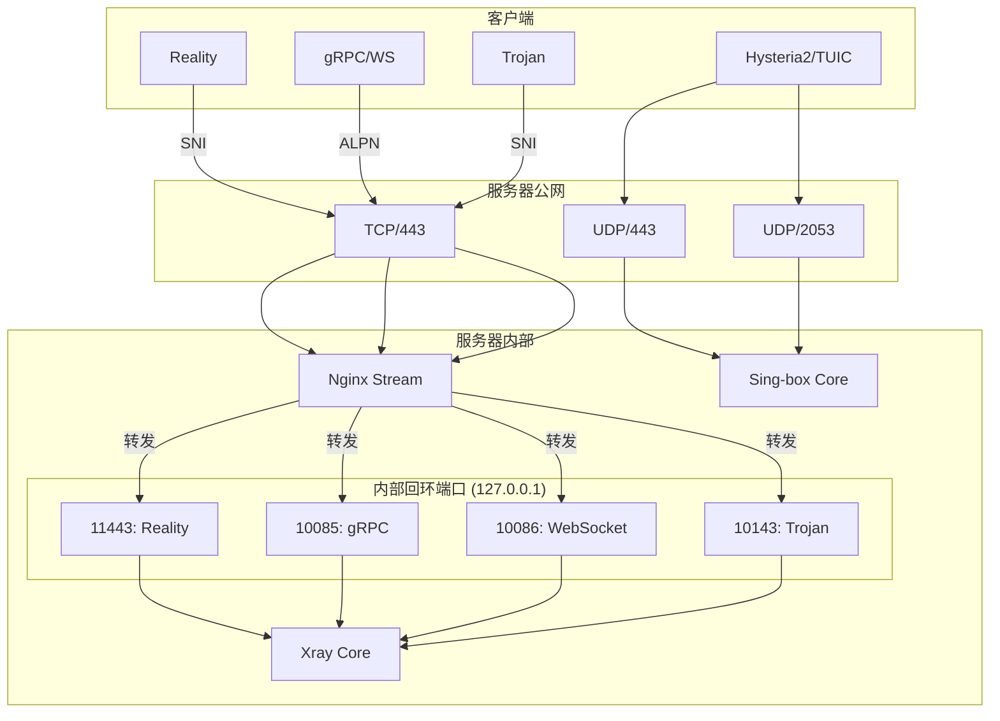

# 🌐 EdgeBox：企业级多协议节点部署与运维平台

# 🌐 EdgeBox：企业级多协议节点部署与运维平台

**EdgeBox 是一个为您打造的高级、安全且易于管理的私有网络网关。它不仅仅是一个代理工具或加密通道，更是一个专注于规避审查、保障您自由、安全访问互联网（“科学上网”）的综合解决方案。通过独特的架构、精选的协议组合和动态安全特性，EdgeBox 旨在提供稳定、隐蔽且可靠的网络体验。**

EdgeBox 旨在通过一键部署，为您提供一个**健壮、灵活、安全且易于管理**的私有网络环境。它通过精巧的**协议组合、端口复用、动态安全增强**和**智能出站分流**等核心策略，实现了深度流量伪装和灵活路由，以应对复杂多变的网络环境。

同时，它内置了强大的可视化**控制面板**和 `edgeboxctl` **命令行工具**，集成了证书管理、流量统计、自动备份、IP质量检测等完备的运维功能，满足从日常使用到高级管理的全部需求。

-----
## ✨ 核心特性

* **一键部署，零配置启动**：单个命令完成全自动部署，默认 IP 模式开箱即用。
* **企业级网络架构**：独创 **Nginx-First 单端口复用** 架构，所有 TCP 协议（VLESS/Trojan）汇聚于 443 端口，由 Nginx 进行 SNI/ALPN 流量分发，核心服务不暴露公网，兼具安全与性能。
* **黄金协议组合**：内置六种最优协议（VLESS-Reality/gRPC/WS, Trojan, Hysteria2, TUIC），覆盖从强对抗到高性能的所有场景，并经深度分析论证，避免冗余。
* **动态安全增强系统**：
    * **Reality 密钥自动轮换**：定时更换密钥对，降低长期暴露风险。
    * **SNI 域名池智能管理**：自动从备选池中选择最优伪装域名，打破流量特征定势。
    * **流量特征随机化**：定时微调协议参数，对抗基于指纹的 DPI 检测。
* **强大的出站分流**：支持 **VPS 直连**、**代理全量出站** 和 **智能分流**（白名单直连，其余走代理）三种模式，可通过 `edgeboxctl` 一键切换。
* **可视化控制面板**：提供一个现代化的 Web UI，实时监控系统负载、流量图表、协议状态，并集成常用运维命令参考。
* **全功能命令行工具 (`edgeboxctl`)**：一个命令满足所有运维需求，包括证书切换、分流管理、流量预警、备份恢复、用户订阅管理等。
* **完善的运维生态**：内置流量统计与多渠道预警、IP 质量检测（IPq）、自动备份与恢复、协议健康检查与自愈、独立用户订阅系统等高级功能。

-----
## 🚀 快速开始

连接到您的服务器（推荐 Ubuntu 20.04+ 或 Debian 10+ 纯净系统），执行以下命令即可一键部署：

```bash
bash <(curl -fsSL [https://raw.githubusercontent.com/cuiping89/node/refs/heads/main/ENV/install.sh](https://raw.githubusercontent.com/cuiping89/node/refs/heads/main/ENV/install.sh))
```
> **提示**: 如果您的服务器在国内，访问 GitHub 可能较慢。您可以在安装命令前添加代理来加速下载，例如：`export EDGEBOX_DOWNLOAD_PROXY="https://ghproxy.com/"`。

部署成功后，您将看到一个信息汇总界面，其中包含了您的控制面板地址和订阅链接。

* **浏览器访问**：`http://<您的IP地址>` 即可打开控制面板。
* **命令行管理**：`edgeboxctl help` 查看所有可用命令。

-----
## 🛠️ 技术架构深度解析

EdgeBox 的核心是其分层且解耦的架构设计，确保了系统的稳定与高效。

### 网络流量模型 (Nginx-First)


* **Nginx 作为 TCP 唯一入口**：监听 `TCP/443`，通过 `ssl_preread` 模块识别流量的 SNI 和 ALPN，然后将流量转发至 Xray 在内部监听的不同端口。
* **Xray 核心服务**：在内部回环地址 (`127.0.0.1`) 上监听，处理由 Nginx 转发来的 VLESS 和 Trojan 流量，不直接暴露于公网。
* **Sing-box 独立处理 UDP**：直接监听公网 UDP 端口，负责 Hysteria2 和 TUIC 协议，以保证最佳性能。

-----
## 🎛️ 管理与运维

EdgeBox 提供了 Web 控制面板和 `edgeboxctl` 命令行两种方式进行管理。

* **Web 控制面板**：专注于“监”和“看”。您可以在此查看系统状态、流量图表、协议健康度、IP 质量评分和订阅链接。
* **`edgeboxctl` 命令行**：专注于“管”和“控”。所有配置变更、模式切换、安全操作和高级运维功能都通过此工具完成。

| 功能分类 | `edgeboxctl` 核心命令 |
| :--- | :--- |
| **核心管理** | `status`, `sub`, `restart`, `logs <svc>`, `update` |
| **证书与模式** | `switch-to-domain <domain>`, `switch-to-ip`, `cert status` |
| **安全增强** | `sni auto`, `rotate-reality`, `rotate-sid`, `traffic randomize` |
| **出站分流** | `shunt vps`, `shunt resi <URL>`, `shunt direct-resi <URL>`, `shunt whitelist ...` |
| **流量与预警** | `traffic show`, `alert monthly <GiB>`, `alert telegram <...>` |
| **备份恢复** | `backup create`, `backup list`, `backup restore <file>` |
| **用户订阅** | `sub issue <user>`, `sub revoke <user>`, `sub limit <user> <N>` |

*要了解所有命令的详细用法，请参阅 **[命令行工具参考](docs/用户指南%20(User%20Guide)/03-命令行工具参考.md)**。*

-----
## 📄 文档

我们为您提供了完善的文档，帮助您从入门到精通。

* **用户指南**:
    * [快速上手](docs/用户指南%20(User%20Guide)/01-快速上手.md)
    * [控制面板详解](docs/用户指南%20(User%20Guide)/02-控制面板详解.md)
    * [客户端配置指南](docs/用户指南%20(User%20Guide)/客户端配置(Client%20Config)/📄%2000-通用配置指南.md)
* **高级功能**:
    * [证书与模式切换](docs/高级功能%20(Advanced%20Features)/01-证书与模式切换.md)
    * [出站路由与分流](docs/高级功能%20(Advanced%20Features)/02-出站路由与分流.md)
    * [安全增强技术](docs/高级功能%20(Advanced%20Features)/04-安全增强技术.md)
    * [独立用户订阅系统](docs/高级功能%20(Advanced%20Features)/06-独立用户订阅系统.md)
* **开发者文档**:
    * [项目总览](docs/开发者文档%20(For%20Developers)/项目总览.md)
    * [开发者指南](docs/开发者文档%20(For%20Developers)/开发者指南.md)

-----
## ❤️ 支持项目

如果 EdgeBox 对您有帮助，欢迎通过打赏来支持项目的持续开发！


-----
## 📄 许可证

本项目采用 MIT 许可证。
