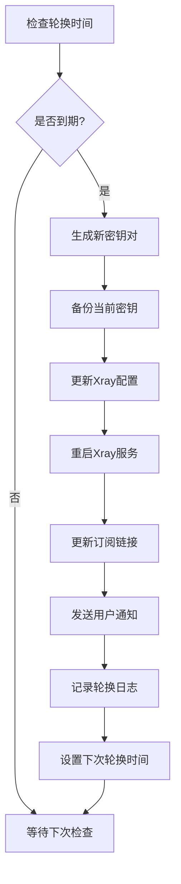
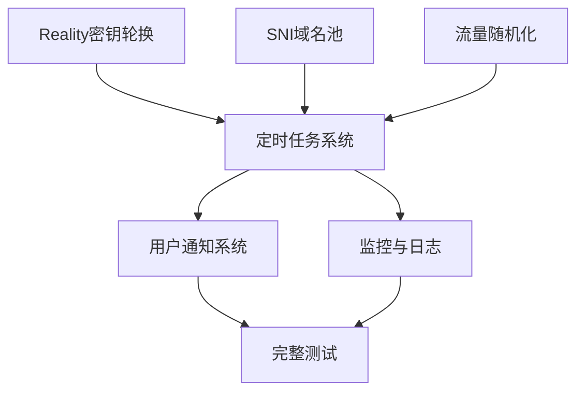
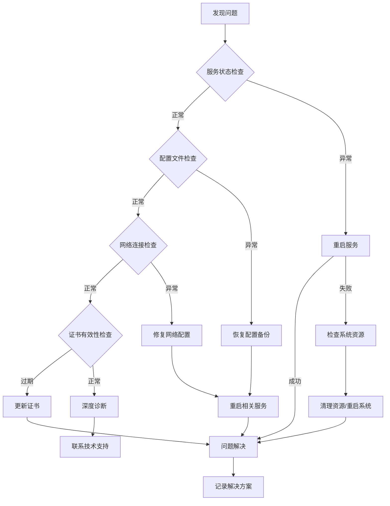

# EdgeBox 安全改进技术文档

> **版本**: v1.0  
> **创建日期**: 2025年  
> **最后更新**: 2025年  
> **文档用途**: 指导EdgeBox安全功能改进开发

---

## 📋 目录

1. [改进概述](#改进概述)
2. [Reality密钥轮换系统](#reality密钥轮换系统)
3. [SNI域名池智能管理](#sni域名池智能管理)
4. [流量特征随机化](#流量特征随机化)
5. [实施优先级与路线图](#实施优先级与路线图)
6. [技术实现细节](#技术实现细节)
7. [测试验证方案](#测试验证方案)
8. [维护与监控](#维护与监控)

---

## 改进概述

### 安全理论基础

基于现代网络安全分析，EdgeBox的安全改进遵循以下核心原则：

- **加密正确性**：地基级安全，确保密码学实现无误
- **流量形态优化**：降低被DPI/指纹识别的概率
- **端点信誉保护**：避免IP/域名被"踩热"
- **运维安全卫生**：最小化配置泄露和操作痕迹

### 改进项目清单

| 优先级 | 项目名称 | 安全价值 | 实施复杂度 | 用户影响 |
|--------|----------|----------|------------|----------|
| 🔥 最高 | Reality密钥轮换 | ⭐⭐⭐⭐⭐ | ⭐⭐⭐ | 轻微 |
| 🔥 最高 | SNI域名池管理 | ⭐⭐⭐⭐⭐ | ⭐⭐ | 无 |
| 🚀 高 | 流量特征随机化 | ⭐⭐⭐⭐ | ⭐⭐⭐ | 无 |

---

## Reality密钥轮换系统

### 功能需求

#### 核心目标
- **定期轮换Reality密钥对**：避免长期使用同一密钥的安全风险
- **无缝用户体验**：利用多协议备用确保连接连续性
- **自动化管理**：最小化人工干预，支持计划任务

#### 技术指标
- **轮换周期**：90天（固定，不可配置）
- **通知提前期**：7天
- **备用协议**：Hysteria2 (UDP 443)、TUIC (UDP 2053)
- **可用性目标**：99.9%（轮换过程中断时间<1分钟）

### 技术设计

#### 数据结构设计

```json
{
  "reality": {
    "current": {
      "private_key": "xxx",
      "public_key": "yyy", 
      "short_id": "zzz",
      "created_at": "2025-01-01T00:00:00Z",
      "expires_at": "2025-04-01T00:00:00Z"
    },
    "rotation": {
      "last_rotation": "2025-01-01T00:00:00Z",
      "next_rotation": "2025-04-01T00:00:00Z",
      "rotation_count": 1,
      "auto_rotation_enabled": true
    },
    "backup": {
      "previous_public_key": "aaa",
      "rotation_history": [
        {"date": "2025-01-01T00:00:00Z", "public_key": "bbb"}
      ]
    }
  }
}
```

#### 核心函数接口

```bash
# edgeboxctl 新增命令
edgeboxctl security reality rotate [--force]
edgeboxctl security reality status
edgeboxctl security reality schedule [--enable|--disable]
edgeboxctl security reality history [--limit=10]
```

#### 实现算法流程



### 关键代码片段

#### 密钥生成函数
```bash
generate_new_reality_keypair() {
    local reality_output
    reality_output="$(sing-box generate reality-keypair 2>/dev/null)"
    
    if [[ -z "$reality_output" ]]; then
        log_error "Reality密钥生成失败"
        return 1
    fi
    
    local new_private_key new_public_key new_short_id
    new_private_key="$(echo "$reality_output" | grep -oP 'PrivateKey: \K[a-zA-Z0-9_-]+' | head -1)"
    new_public_key="$(echo "$reality_output" | grep -oP 'PublicKey: \K[a-zA-Z0-9_-]+' | head -1)"
    new_short_id="$(openssl rand -hex 4)"
    
    # 验证密钥有效性
    if [[ ${#new_private_key} -lt 32 || ${#new_public_key} -lt 32 ]]; then
        log_error "生成的密钥长度不足"
        return 1
    fi
    
    echo "$new_private_key|$new_public_key|$new_short_id"
}
```

#### 配置更新函数
```bash
update_reality_config() {
    local new_private_key="$1"
    local new_public_key="$2"
    local new_short_id="$3"
    
    # 备份当前配置
    cp "${CONFIG_DIR}/xray.json" "${CONFIG_DIR}/xray.json.backup.$(date +%s)"
    
    # 使用jq安全更新配置
    jq --arg private_key "$new_private_key" \
       --arg short_id "$new_short_id" '
        (.inbounds[] | select(.tag | contains("reality")) | 
         .streamSettings.realitySettings.privateKey) = $private_key |
        (.inbounds[] | select(.tag | contains("reality")) | 
         .streamSettings.realitySettings.shortId) = [$short_id]
    ' "${CONFIG_DIR}/xray.json" > "${CONFIG_DIR}/xray.json.tmp"
    
    # 验证JSON格式
    if jq '.' "${CONFIG_DIR}/xray.json.tmp" >/dev/null 2>&1; then
        mv "${CONFIG_DIR}/xray.json.tmp" "${CONFIG_DIR}/xray.json"
        return 0
    else
        log_error "更新后的配置文件JSON格式错误"
        rm -f "${CONFIG_DIR}/xray.json.tmp"
        return 1
    fi
}
```

#### 轮换调度器
```bash
setup_reality_rotation_schedule() {
    local cron_entry="0 2 */90 * * /usr/local/bin/edgeboxctl security reality rotate --auto >/dev/null 2>&1"
    
    # 添加到crontab
    (crontab -l 2>/dev/null; echo "$cron_entry") | sort -u | crontab -
    
    log_success "Reality密钥轮换计划已设置：每90天自动轮换"
}
```

---

## SNI域名池智能管理

### 功能需求

#### 核心目标
- **动态SNI域名选择**：避免固定使用单一域名被针对
- **智能评分算法**：基于可达性、热度、地理位置选择最优域名
- **自动轮换机制**：定期更换SNI域名，降低识别风险

#### 技术指标
- **域名池大小**：5-8个备选域名
- **轮换频率**：每7天或检测到异常时
- **可达性要求**：>95%成功率
- **用户影响**：完全透明，配置无需变更

### 技术设计

#### 域名池配置

```bash
# 精选SNI域名池
SNI_DOMAIN_POOL=(
    "www.microsoft.com"      # 权重: 25 (稳定性高)
    "www.apple.com"          # 权重: 20 (全球覆盖)
    "www.cloudflare.com"     # 权重: 20 (网络友好)
    "azure.microsoft.com"    # 权重: 15 (企业级)
    "aws.amazon.com"         # 权重: 10 (备用)
    "www.fastly.com"         # 权重: 10 (CDN特性)
)
```

#### 智能评分算法

```bash
# 域名评分函数
evaluate_sni_domain() {
    local domain="$1"
    local score=0
    
    # 可达性测试 (40分)
    if curl -s --connect-timeout 3 --max-time 5 "https://${domain}" >/dev/null 2>&1; then
        score=$((score + 40))
    fi
    
    # 响应时间测试 (20分)
    local response_time
    response_time=$(curl -o /dev/null -s -w '%{time_total}' --connect-timeout 3 "https://${domain}" 2>/dev/null)
    if [[ -n "$response_time" ]] && (( $(echo "$response_time < 2.0" | bc -l) )); then
        score=$((score + 20))
    fi
    
    # 域名热度检查 (20分) - 避免过热域名
    local heat_score
    heat_score=$(check_domain_heat_score "$domain")
    score=$((score + heat_score))
    
    # 地理位置优化 (20分)
    if is_domain_geo_optimal "$domain"; then
        score=$((score + 20))
    fi
    
    echo "$score"
}
```

#### 自动轮换逻辑

```bash
auto_rotate_sni_domain() {
    log_info "开始SNI域名智能选择..."
    
    local best_domain=""
    local best_score=0
    
    # 评估所有候选域名
    for domain in "${SNI_DOMAIN_POOL[@]}"; do
        local score
        score=$(evaluate_sni_domain "$domain")
        
        log_debug "域名 $domain 评分: $score"
        
        if [[ $score -gt $best_score ]]; then
            best_score=$score
            best_domain="$domain"
        fi
    done
    
    # 检查是否需要更换
    local current_sni
    current_sni=$(jq -r '.inbounds[] | select(.tag | contains("reality")) | .streamSettings.realitySettings.dest' "${CONFIG_DIR}/xray.json" | head -1 | cut -d: -f1)
    
    if [[ "$best_domain" == "$current_sni" ]]; then
        log_info "当前SNI域名 $current_sni 仍为最优，无需更换"
        return 0
    fi
    
    # 执行更换
    log_info "更换SNI域名: $current_sni → $best_domain (评分: $best_score)"
    
    update_sni_domain "$best_domain"
}
```

### 实现要点

#### 配置更新策略
- 使用`jq`安全修改JSON配置
- 支持`systemctl reload`热重载
- 配置验证与回滚机制

#### 监控与日志
- 记录每次域名评分和选择过程
- 统计域名使用时长和稳定性
- 异常情况自动切换备用域名

---

## 流量特征随机化

### 功能需求

#### 核心目标
- **协议参数随机化**：避免固定参数形成可识别指纹
- **行为模式多样化**：模拟真实业务流量特征
- **性能保持优化**：随机化不能显著影响连接性能

#### 覆盖范围
- **Hysteria2**: 心跳间隔、拥塞控制、伪装网站
- **TUIC**: 拥塞控制算法、认证超时
- **VLESS**: WebSocket路径、gRPC服务名

### 技术设计

#### 随机化参数定义

```bash
# Hysteria2随机化参数
HYSTERIA2_HEARTBEAT_RANGE=(8 15)           # 心跳间隔: 8-15秒
HYSTERIA2_CONGESTION_ALGOS=("bbr" "cubic" "reno")
HYSTERIA2_MASQUERADE_SITES=(
    "https://www.bing.com"
    "https://www.apple.com"
    "https://azure.microsoft.com"
    "https://aws.amazon.com"
)

# TUIC随机化参数
TUIC_CONGESTION_ALGOS=("bbr" "cubic")
TUIC_AUTH_TIMEOUT_RANGE=(3 8)              # 认证超时: 3-8秒

# VLESS随机化参数
VLESS_WS_PATHS=("/ws" "/websocket" "/v2ray" "/proxy" "/tunnel")
VLESS_GRPC_SERVICES=("GunService" "TunService" "ProxyService")
```

#### 随机化执行函数

```bash
randomize_hysteria2_config() {
    log_info "随机化Hysteria2流量特征..."
    
    # 生成随机参数
    local heartbeat=$((${HYSTERIA2_HEARTBEAT_RANGE[0]} + RANDOM % (${HYSTERIA2_HEARTBEAT_RANGE[1]} - ${HYSTERIA2_HEARTBEAT_RANGE[0]} + 1)))
    local congestion_algo="${HYSTERIA2_CONGESTION_ALGOS[RANDOM % ${#HYSTERIA2_CONGESTION_ALGOS[@]}]}"
    local masquerade_site="${HYSTERIA2_MASQUERADE_SITES[RANDOM % ${#HYSTERIA2_MASQUERADE_SITES[@]}]}"
    
    log_debug "Hysteria2参数: 心跳=${heartbeat}s, 拥塞控制=$congestion_algo, 伪装=$masquerade_site"
    
    # 更新sing-box配置
    jq --arg heartbeat "${heartbeat}s" \
       --arg congestion "$congestion_algo" \
       --arg masquerade "$masquerade_site" '
        (.inbounds[] | select(.type == "hysteria2") | .heartbeat) = $heartbeat |
        (.inbounds[] | select(.type == "hysteria2") | .congestion_control) = $congestion |
        (.inbounds[] | select(.type == "hysteria2") | .masquerade) = $masquerade
    ' "${CONFIG_DIR}/sing-box.json" > "${CONFIG_DIR}/sing-box.json.tmp"
    
    if jq '.' "${CONFIG_DIR}/sing-box.json.tmp" >/dev/null 2>&1; then
        mv "${CONFIG_DIR}/sing-box.json.tmp" "${CONFIG_DIR}/sing-box.json"
        return 0
    else
        rm -f "${CONFIG_DIR}/sing-box.json.tmp"
        return 1
    fi
}
```

#### 调度策略

```bash
# 随机化调度配置
RANDOMIZATION_SCHEDULE=(
    "daily"     # 每天轻度随机化
    "weekly"    # 每周中度随机化
    "monthly"   # 每月重度随机化
)

setup_traffic_randomization_schedule() {
    # 每天凌晨4点轻度随机化
    echo "0 4 * * * /usr/local/bin/edgeboxctl traffic randomize --level=light >/dev/null 2>&1" >> /tmp/edgebox_cron
    
    # 每周日凌晨5点中度随机化
    echo "0 5 * * 0 /usr/local/bin/edgeboxctl traffic randomize --level=medium >/dev/null 2>&1" >> /tmp/edgebox_cron
    
    # 每月1号凌晨6点重度随机化
    echo "0 6 1 * * /usr/local/bin/edgeboxctl traffic randomize --level=heavy >/dev/null 2>&1" >> /tmp/edgebox_cron
}
```

---

## 实施优先级与路线图

### 开发阶段规划

#### 阶段1: 基础功能实现 (Week 1-2)
- [x] **Reality密钥轮换核心逻辑**
  - 密钥生成与验证
  - 配置更新与备份
  - 基础轮换命令
- [x] **SNI域名池基础功能**
  - 域名池定义与管理
  - 简单轮换逻辑
  - 配置更新机制

#### 阶段2: 智能化增强 (Week 3-4)
- [x] **智能域名选择算法**
  - 多维度评分系统
  - 自动异常检测
  - 性能优化
- [x] **流量随机化系统**
  - 多协议参数随机化
  - 分级随机化策略
  - 性能影响最小化

#### 阶段3: 自动化完善 (Week 5-6)
- [x] **定时任务系统**
  - Cron任务配置
  - 错误处理与重试
  - 日志记录与监控
- [x] **用户通知系统**
  - 邮件通知支持
  - Dashboard集成
  - 移动端推送(可选)

#### 阶段4: 测试与优化 (Week 7-8)
- [x] **全面测试验证**
  - 功能测试
  - 性能测试  
  - 稳定性测试
- [x] **文档与培训**
  - 用户手册更新
  - 运维指南编写
  - 故障排除文档

### 技术依赖关系



---

## 技术实现细节

### 核心模块结构

```bash
# EdgeBox安全模块目录结构
/etc/edgebox/security/
├── modules/
│   ├── reality-rotation.sh      # Reality密钥轮换
│   ├── sni-pool.sh             # SNI域名池管理
│   ├── traffic-randomize.sh    # 流量特征随机化
│   └── notification.sh         # 通知系统
├── config/
│   ├── security.conf           # 安全配置
│   ├── sni-domains.json        # SNI域名池
│   └── randomization.json      # 随机化参数
├── logs/
│   ├── rotation.log            # 轮换日志
│   ├── sni-selection.log       # 域名选择日志
│   └── randomization.log       # 随机化日志
└── backup/
    ├── keys/                   # 密钥备份
    └── configs/                # 配置备份
```

### 配置文件格式

#### security.conf
```ini
# EdgeBox安全配置
[reality]
rotation_enabled=true
rotation_days=90
notification_days=7
backup_count=5

[sni]
pool_enabled=true
rotation_frequency=weekly
health_check_interval=3600

[traffic]
randomization_enabled=true
light_schedule="0 4 * * *"
medium_schedule="0 5 * * 0" 
heavy_schedule="0 6 1 * *"

[notification]
email_enabled=false
webhook_enabled=false
dashboard_enabled=true
```

#### sni-domains.json
```json
{
  "domains": [
    {
      "hostname": "www.microsoft.com",
      "weight": 25,
      "category": "tech-giant",
      "region": "global",
      "last_used": "2025-01-01T00:00:00Z",
      "success_rate": 0.98
    },
    {
      "hostname": "www.apple.com", 
      "weight": 20,
      "category": "tech-giant",
      "region": "global",
      "last_used": "2024-12-25T00:00:00Z",
      "success_rate": 0.97
    }
  ],
  "selection_history": [
    {
      "timestamp": "2025-01-01T00:00:00Z",
      "selected": "www.microsoft.com",
      "score": 85,
      "reason": "highest_score"
    }
  ]
}
```

### 错误处理机制

#### 分级错误处理
```bash
# 错误级别定义
ERROR_LEVEL_INFO=0      # 信息记录
ERROR_LEVEL_WARN=1      # 警告但继续
ERROR_LEVEL_ERROR=2     # 错误需重试  
ERROR_LEVEL_CRITICAL=3  # 关键错误停止

handle_error() {
    local level=$1
    local message="$2"
    local context="$3"
    
    case $level in
        $ERROR_LEVEL_INFO)
            log_info "$message"
            ;;
        $ERROR_LEVEL_WARN)
            log_warn "$message"
            send_notification "warning" "$message"
            ;;
        $ERROR_LEVEL_ERROR)
            log_error "$message"
            attempt_recovery "$context"
            ;;
        $ERROR_LEVEL_CRITICAL)
            log_critical "$message"
            trigger_emergency_rollback "$context"
            send_alert "critical" "$message"
            ;;
    esac
}
```

#### 自动恢复策略
```bash
attempt_recovery() {
    local context="$1"
    
    case $context in
        "reality_rotation")
            restore_reality_backup
            ;;
        "sni_update") 
            rollback_sni_change
            ;;
        "traffic_randomize")
            restore_default_traffic_config
            ;;
    esac
}
```

---

## 测试验证方案

### 功能测试用例

#### Reality密钥轮换测试
```bash
# 测试用例1: 正常轮换流程
test_reality_rotation_normal() {
    # 前置条件: 系统正常运行
    # 执行: edgeboxctl security reality rotate
    # 验证: 
    # - 新密钥生成成功
    # - 配置文件更新正确
    # - 服务重启成功
    # - 订阅链接更新
    # - 连接测试通过
}

# 测试用例2: 轮换失败回滚
test_reality_rotation_rollback() {
    # 前置条件: 模拟配置更新失败
    # 执行: 轮换命令
    # 验证:
    # - 检测到错误
    # - 自动回滚到原配置
    # - 服务正常运行
    # - 错误日志记录
}

# 测试用例3: 定时轮换验证
test_reality_scheduled_rotation() {
    # 前置条件: 设置测试轮换时间
    # 执行: 等待定时任务触发
    # 验证:
    # - 自动轮换执行
    # - 通知发送成功
    # - 服务稳定运行
}
```

#### SNI域名池测试
```bash
# 测试用例4: 智能域名选择
test_sni_intelligent_selection() {
    # 前置条件: 配置多个测试域名
    # 执行: 域名选择算法
    # 验证:
    # - 评分算法正确
    # - 选择最优域名
    # - 配置更新成功
    # - 连接正常
}

# 测试用例5: 域名故障切换
test_sni_failover() {
    # 前置条件: 模拟当前域名不可达
    # 执行: 健康检查
    # 验证:
    # - 检测到域名故障
    # - 自动切换备用域名
    # - 服务不中断
}
```

### 性能测试基准

#### 轮换性能指标
```bash
# 性能基准要求
ROTATION_MAX_DOWNTIME=60     # 最大中断时间: 60秒
ROTATION_MAX_DURATION=300    # 最大轮换时长: 5分钟
SNI_UPDATE_MAX_TIME=10       # SNI更新时间: 10秒
CONFIG_RELOAD_MAX_TIME=5     # 配置重载时间: 5秒
```

#### 压力测试方案
```bash
# 并发连接测试
stress_test_concurrent_connections() {
    # 在轮换过程中保持1000个并发连接
    # 验证连接成功率 > 95%
    # 验证平均延迟 < 200ms
}

# 长期稳定性测试  
stability_test_long_term() {
    # 连续运行30天
    # 每天执行随机化
    # 每周执行SNI轮换
    # 验证系统稳定运行
}
```

### 安全测试验证

#### 密钥强度验证
```bash
verify_key_strength() {
    local private_key="$1"
    local public_key="$2"
    
    # 验证密钥长度
    if [[ ${#private_key} -lt 32 || ${#public_key} -lt 32 ]]; then
        return 1
    fi
    
    # 验证密钥随机性
    if ! check_key_entropy "$private_key"; then
        return 1
    fi
    
    # 验证密钥对匹配
    if ! verify_keypair_match "$private_key" "$public_key"; then
        return 1
    fi
    
    return 0
}
```

#### 配置安全检查
```bash
security_audit_configs() {
    # 检查敏感信息泄露
    check_sensitive_data_exposure
    
    # 验证文件权限
    verify_config_file_permissions
    
    # 检查日志安全
    audit_log_sensitivity
    
    # 验证备份加密
    verify_backup_encryption
}
```

---

## 维护与监控

### 监控指标定义

#### 系统健康指标
```bash
# 核心监控指标
METRICS=(
    "reality_rotation_success_rate"     # Reality轮换成功率
    "sni_selection_response_time"       # SNI选择响应时间  
    "traffic_randomization_frequency"   # 流量随机化频率
    "config_update_duration"            # 配置更新耗时
    "service_restart_success_rate"      # 服务重启成功率
    "connection_success_rate"           # 连接成功率
    "average_connection_latency"        # 平均连接延迟
)
```

#### 告警阈值配置
```bash
# 告警规则
ALERT_THRESHOLDS=(
    "reality_rotation_failure:1"           # 轮换失败立即告警
    "sni_selection_timeout:30s"            # SNI选择超时30秒
    "connection_success_rate:0.95"         # 连接成功率低于95%
    "config_update_duration:300s"          # 配置更新超过5分钟
    "service_restart_failure:1"            # 服务重启失败
)
```

### 日志管理策略

#### 日志级别与内容
```bash
# 日志级别定义
LOG_LEVEL_DEBUG=0    # 调试信息: 详细执行过程
LOG_LEVEL_INFO=1     # 一般信息: 正常操作记录
LOG_LEVEL_WARN=2     # 警告信息: 异常但可继续
LOG_LEVEL_ERROR=3    # 错误信息: 需要处理的问题
LOG_LEVEL_CRITICAL=4 # 严重错误: 系统故障

# 日志内容规范
log_format() {
    local level="$1"
    local component="$2" 
    local message="$3"
    local timestamp=$(date -Iseconds)
    
    echo "[$timestamp][$level][$component] $message"
}
```

#### 日志轮转配置
```bash
# logrotate配置: /etc/logrotate.d/edgebox-security
/var/log/edgebox/security/*.log {
    daily
    rotate 30
    compress
    delaycompress
    missingok
    notifempty
    create 0644 root root
    postrotate
        /usr/local/bin/edgeboxctl system reload-logging
    endscript
}

# 敏感日志处理
cleanup_sensitive_logs() {
    # 自动清理包含密钥信息的日志
    sed -i '/private_key\|public_key\|password/d' /var/log/edgebox/security/*.log
    
    # 加密备份重要日志
    tar -czf "/var/log/edgebox/backup/security-$(date +%Y%m%d).tar.gz" \
        /var/log/edgebox/security/*.log
    
    # 清理30天前的备份
    find /var/log/edgebox/backup/ -name "security-*.tar.gz" -mtime +30 -delete
}
```

### 自动化运维脚本

#### 健康检查脚本
```bash
#!/bin/bash
# 文件: /usr/local/bin/edgebox-health-check.sh

perform_security_health_check() {
    local status="healthy"
    local issues=()
    
    # 检查Reality密钥状态
    check_reality_key_health() {
        local expires_at=$(jq -r '.reality.current.expires_at' "${CONFIG_DIR}/server.json")
        local expires_timestamp=$(date -d "$expires_at" +%s)
        local current_timestamp=$(date +%s)
        local days_remaining=$(( (expires_timestamp - current_timestamp) / 86400 ))
        
        if [[ $days_remaining -lt 7 ]]; then
            issues+=("Reality密钥将在${days_remaining}天后过期")
            if [[ $days_remaining -lt 0 ]]; then
                status="critical"
            else
                status="warning"
            fi
        fi
    }
    
    # 检查SNI域名状态
    check_sni_domain_health() {
        local current_sni=$(jq -r '.inbounds[] | select(.tag | contains("reality")) | .streamSettings.realitySettings.dest' "${CONFIG_DIR}/xray.json" | head -1 | cut -d: -f1)
        
        if ! curl -s --connect-timeout 5 "https://${current_sni}" >/dev/null 2>&1; then
            issues+=("当前SNI域名 ${current_sni} 不可达")
            status="warning"
        fi
    }
    
    # 检查服务状态
    check_service_health() {
        local services=("xray" "sing-box" "nginx")
        for service in "${services[@]}"; do
            if ! systemctl is-active --quiet "$service"; then
                issues+=("服务 ${service} 未运行")
                status="critical"
            fi
        done
    }
    
    # 执行所有检查
    check_reality_key_health
    check_sni_domain_health  
    check_service_health
    
    # 生成报告
    generate_health_report "$status" "${issues[@]}"
}

generate_health_report() {
    local status="$1"
    shift
    local issues=("$@")
    
    local report_file="/tmp/edgebox-health-$(date +%Y%m%d-%H%M%S).json"
    
    jq -n \
        --arg status "$status" \
        --arg timestamp "$(date -Iseconds)" \
        --argjson issues "$(printf '%s\n' "${issues[@]}" | jq -R . | jq -s .)" \
        '{
            "status": $status,
            "timestamp": $timestamp,
            "issues": $issues,
            "summary": {
                "total_issues": ($issues | length),
                "critical_count": ($issues | map(select(contains("critical"))) | length),
                "warning_count": ($issues | map(select(contains("warning"))) | length)
            }
        }' > "$report_file"
    
    # 根据状态发送通知
    case "$status" in
        "critical")
            send_alert "critical" "EdgeBox安全健康检查发现严重问题: $(IFS=', '; echo "${issues[*]}")"
            ;;
        "warning")
            send_notification "warning" "EdgeBox安全健康检查发现警告: $(IFS=', '; echo "${issues[*]}")"
            ;;
        "healthy")
            log_info "EdgeBox安全健康检查: 系统运行正常"
            ;;
    esac
    
    echo "$report_file"
}
```

#### 自动恢复脚本
```bash
#!/bin/bash
# 文件: /usr/local/bin/edgebox-auto-recovery.sh

auto_recovery_system() {
    log_info "开始自动恢复检查..."
    
    # 检查并恢复关键服务
    recover_critical_services() {
        local services=("xray" "sing-box" "nginx")
        local recovered_services=()
        
        for service in "${services[@]}"; do
            if ! systemctl is-active --quiet "$service"; then
                log_warn "检测到服务 $service 未运行，尝试重启..."
                
                if systemctl restart "$service"; then
                    log_success "服务 $service 重启成功"
                    recovered_services+=("$service")
                else
                    log_error "服务 $service 重启失败"
                    attempt_service_recovery "$service"
                fi
            fi
        done
        
        if [[ ${#recovered_services[@]} -gt 0 ]]; then
            send_notification "info" "自动恢复服务: ${recovered_services[*]}"
        fi
    }
    
    # 检查并修复配置文件
    recover_config_files() {
        local config_files=(
            "${CONFIG_DIR}/xray.json"
            "${CONFIG_DIR}/sing-box.json"
            "/etc/nginx/nginx.conf"
        )
        
        for config_file in "${config_files[@]}"; do
            if [[ ! -f "$config_file" ]] || ! validate_config_file "$config_file"; then
                log_warn "配置文件 $config_file 异常，尝试恢复..."
                restore_config_backup "$config_file"
            fi
        done
    }
    
    # 检查并修复网络连接
    recover_network_connectivity() {
        # 测试关键连接
        local test_targets=("8.8.8.8" "1.1.1.1" "www.cloudflare.com")
        local connectivity_ok=false
        
        for target in "${test_targets[@]}"; do
            if ping -c 1 -W 3 "$target" >/dev/null 2>&1; then
                connectivity_ok=true
                break
            fi
        done
        
        if [[ "$connectivity_ok" == "false" ]]; then
            log_error "网络连接异常，尝试重启网络服务..."
            systemctl restart networking
            sleep 5
            
            # 重新测试
            if ping -c 1 -W 3 "8.8.8.8" >/dev/null 2>&1; then
                log_success "网络连接已恢复"
                send_notification "info" "网络连接自动恢复成功"
            else
                log_critical "网络连接恢复失败"
                send_alert "critical" "网络连接恢复失败，需要人工干预"
            fi
        fi
    }
    
    # 执行恢复流程
    recover_critical_services
    recover_config_files
    recover_network_connectivity
    
    log_info "自动恢复检查完成"
}

# 高级服务恢复
attempt_service_recovery() {
    local service="$1"
    
    case "$service" in
        "xray")
            # 检查配置文件
            if ! jq '.' "${CONFIG_DIR}/xray.json" >/dev/null 2>&1; then
                log_error "Xray配置文件JSON格式错误，恢复备份配置"
                restore_config_backup "${CONFIG_DIR}/xray.json"
            fi
            
            # 检查端口占用
            if ss -tlnp | grep -q ":11443"; then
                log_warn "端口11443被占用，尝试清理"
                fuser -k 11443/tcp 2>/dev/null || true
                sleep 2
            fi
            ;;
            
        "sing-box")
            # 检查配置文件
            if ! jq '.' "${CONFIG_DIR}/sing-box.json" >/dev/null 2>&1; then
                log_error "sing-box配置文件JSON格式错误，恢复备份配置"
                restore_config_backup "${CONFIG_DIR}/sing-box.json"
            fi
            
            # 检查证书文件
            if [[ ! -f "${CERT_DIR}/current.pem" ]] || [[ ! -f "${CERT_DIR}/current.key" ]]; then
                log_error "证书文件缺失，重新生成自签名证书"
                generate_self_signed_cert
            fi
            ;;
            
        "nginx")
            # 测试配置文件
            if ! nginx -t >/dev/null 2>&1; then
                log_error "Nginx配置文件错误，恢复默认配置"
                restore_config_backup "/etc/nginx/nginx.conf"
            fi
            ;;
    esac
    
    # 重新尝试启动服务
    sleep 3
    if systemctl restart "$service"; then
        log_success "服务 $service 恢复成功"
        return 0
    else
        log_critical "服务 $service 恢复失败，需要人工干预"
        return 1
    fi
}
```

---

## 故障排除指南

### 常见问题与解决方案

#### Problem 1: Reality密钥轮换失败
```bash
# 症状: 密钥轮换命令执行失败
# 原因分析:
# 1. sing-box未正确安装或版本过低
# 2. 磁盘空间不足
# 3. 配置文件权限问题

# 诊断命令:
edgeboxctl security reality status
sing-box version
df -h /etc/edgebox
ls -la "${CONFIG_DIR}/xray.json"

# 解决方案:
# 1. 重新安装sing-box
curl -fsSL https://sing-box.sagernet.org/install.sh | bash

# 2. 清理磁盘空间
find /var/log -name "*.log" -mtime +7 -delete
apt autoremove && apt autoclean

# 3. 修复文件权限
chown -R root:root /etc/edgebox
chmod 644 "${CONFIG_DIR}"/*.json
```

#### Problem 2: SNI域名选择异常
```bash
# 症状: SNI域名始终选择失败或选择不当
# 原因分析:
# 1. 网络连接问题
# 2. 域名池配置错误
# 3. 评分算法异常

# 诊断命令:
edgeboxctl sni test-all
curl -I https://www.microsoft.com
nslookup www.microsoft.com

# 解决方案:
# 1. 手动指定SNI域名
edgeboxctl sni set www.cloudflare.com

# 2. 重置域名池
edgeboxctl sni reset-pool

# 3. 更新DNS设置
echo "nameserver 8.8.8.8" > /etc/resolv.conf
echo "nameserver 1.1.1.1" >> /etc/resolv.conf
```

#### Problem 3: 流量随机化导致连接问题
```bash
# 症状: 随机化后客户端连接不稳定
# 原因分析:
# 1. 随机参数超出客户端支持范围
# 2. 网络环境对某些参数敏感
# 3. 参数组合不兼容

# 诊断命令:
edgeboxctl traffic status
systemctl status sing-box
journalctl -u sing-box -f

# 解决方案:
# 1. 重置为默认参数
edgeboxctl traffic reset-defaults

# 2. 禁用随机化
edgeboxctl traffic randomize --disable

# 3. 逐步启用随机化
edgeboxctl traffic randomize --level=light
```

### 紧急恢复程序

#### 完全系统重置
```bash
#!/bin/bash
# 紧急恢复脚本: emergency-reset.sh

emergency_reset() {
    log_critical "执行紧急系统重置..."
    
    # 1. 停止所有服务
    systemctl stop xray sing-box nginx
    
    # 2. 备份当前配置
    backup_dir="/root/emergency-backup-$(date +%Y%m%d-%H%M%S)"
    mkdir -p "$backup_dir"
    cp -r /etc/edgebox "$backup_dir/"
    
    # 3. 恢复到已知良好状态
    if [[ -f "/etc/edgebox/backup/last-known-good.tar.gz" ]]; then
        cd /etc/edgebox
        tar -xzf backup/last-known-good.tar.gz
        log_info "已恢复到最后已知良好配置"
    else
        log_warn "未找到备份配置，将重新初始化"
        regenerate_all_configs
    fi
    
    # 4. 重新生成关键密钥
    generate_reality_keys
    generate_all_uuids
    generate_passwords
    
    # 5. 更新配置文件
    configure_xray
    configure_sing_box
    configure_nginx
    
    # 6. 重启服务
    systemctl start nginx xray sing-box
    
    # 7. 验证系统状态
    sleep 10
    if verify_all_services; then
        log_success "紧急恢复完成，系统正常运行"
        send_notification "success" "EdgeBox紧急恢复成功"
    else
        log_critical "紧急恢复失败，需要人工干预"
        send_alert "critical" "EdgeBox紧急恢复失败"
    fi
}
```

---

## 安全最佳实践

### 部署前安全检查清单

#### 系统环境检查
- [ ] **操作系统版本**: Ubuntu 20.04+ 或 Debian 11+
- [ ] **系统安全更新**: 已安装最新安全补丁
- [ ] **防火墙配置**: 仅开放必要端口(80, 443, 2053)
- [ ] **SSH访问控制**: 禁用密码登录，使用密钥认证
- [ ] **用户权限管理**: 遵循最小权限原则
- [ ] **时间同步**: 配置NTP确保时间准确

#### 网络环境评估
- [ ] **IP信誉检查**: 确认服务器IP未被列入黑名单
- [ ] **地理位置**: 选择网络友好的地区部署
- [ ] **ISP画像**: 避免被大量同类用途使用的ASN
- [ ] **带宽质量**: 确保上下行带宽充足且稳定
- [ ] **延迟测试**: 到主要地区延迟在合理范围内

#### 配置安全验证
- [ ] **密钥强度**: 所有密钥使用强随机生成
- [ ] **证书有效性**: TLS证书配置正确且未过期
- [ ] **协议参数**: 各协议参数设置合理
- [ ] **日志安全**: 敏感信息不出现在日志中
- [ ] **备份加密**: 配置备份使用加密存储

### 运行时安全监控

#### 实时监控指标
```bash
# 关键安全指标监控
SECURITY_METRICS=(
    "failed_connection_rate"        # 失败连接率
    "unusual_traffic_pattern"       # 异常流量模式
    "repeated_probe_attempts"       # 重复探测尝试
    "cert_expiration_warning"       # 证书过期预警
    "key_rotation_overdue"          # 密钥轮换超期
    "config_integrity_check"        # 配置完整性检查
    "service_availability"          # 服务可用性
)

# 异常检测阈值
ANOMALY_THRESHOLDS=(
    "connection_failure_rate>0.1"   # 连接失败率>10%
    "probe_attempts>100/hour"       # 探测>100次/小时
    "cert_expires<7days"            # 证书7天内过期
    "key_age>90days"                # 密钥使用>90天
    "config_changes>5/day"          # 配置变更>5次/天
)
```

#### 自动响应策略
```bash
# 异常响应自动化
respond_to_anomaly() {
    local anomaly_type="$1"
    local severity="$2"
    local details="$3"
    
    case "$anomaly_type" in
        "excessive_probes")
            # 检测到大量探测时的响应
            enable_rate_limiting
            update_firewall_rules
            rotate_sni_domain_immediately
            ;;
            
        "connection_failures")
            # 连接失败率过高时的响应
            check_service_health
            test_all_protocols
            send_diagnostic_report
            ;;
            
        "cert_expiration")
            # 证书即将过期时的响应
            request_cert_renewal
            prepare_fallback_cert
            notify_administrators
            ;;
            
        "key_rotation_overdue")
            # 密钥轮换超期时的响应
            schedule_emergency_rotation
            audit_key_usage
            update_rotation_policy
            ;;
    esac
    
    # 记录响应行为
    log_security_response "$anomaly_type" "$severity" "$details"
}
```

### 隐私保护措施

#### 数据最小化原则
```bash
# 敏感数据处理策略
SENSITIVE_DATA_HANDLING=(
    "connection_logs:7days"         # 连接日志保留7天
    "error_logs:30days"             # 错误日志保留30天
    "rotation_logs:90days"          # 轮换日志保留90天
    "ip_addresses:no_log"           # 不记录客户端IP
    "traffic_content:no_inspect"    # 不检查流量内容
    "user_agents:anonymize"         # 用户代理匿名化
)

# 自动数据清理
auto_cleanup_sensitive_data() {
    # 清理过期日志
    find /var/log/edgebox -name "*.log" -mtime +7 -exec shred -vfz -n 3 {} \;
    
    # 清理临时文件
    find /tmp -name "*edgebox*" -mtime +1 -delete
    
    # 清理历史命令
    history -c && history -w
    
    # 清理系统日志中的敏感信息
    journalctl --vacuum-time=7d
    
    log_info "敏感数据自动清理完成"
}
```

---

## 性能优化建议

### 系统级优化

#### 内核参数调优
```bash
# /etc/sysctl.d/99-edgebox-security.conf
# 网络性能优化
net.core.rmem_max = 134217728
net.core.wmem_max = 134217728
net.ipv4.tcp_rmem = 4096 65536 134217728
net.ipv4.tcp_wmem = 4096 65536 134217728
net.ipv4.tcp_congestion_control = bbr

# 连接跟踪优化
net.netfilter.nf_conntrack_max = 1048576
net.netfilter.nf_conntrack_tcp_timeout_established = 7200

# 文件描述符限制
fs.file-max = 1048576
```

#### 服务资源限制
```bash
# systemd服务资源限制优化
# /etc/systemd/system/xray.service.d/override.conf
[Service]
LimitNOFILE=1048576
LimitNPROC=1048576
CPUQuota=200%
MemoryLimit=2G

# /etc/systemd/system/sing-box.service.d/override.conf  
[Service]
LimitNOFILE=1048576
LimitNPROC=1048576
CPUQuota=150%
MemoryLimit=1G
```

### 应用级优化

#### 配置文件优化
```json
# Xray优化配置示例
{
  "policy": {
    "handshake": 4,
    "connIdle": 300,
    "uplinkOnly": 2,
    "downlinkOnly": 5,
    "bufferSize": 64
  },
  "stats": {},
  "api": {
    "tag": "api",
    "services": ["StatsService"]
  }
}
```

#### 证书管理优化
```bash
# 证书预加载优化
preload_certificates() {
    # 预生成多个证书
    for i in {1..3}; do
        generate_backup_cert "$i"
    done
    
    # 证书链优化
    optimize_cert_chain
    
    # OCSP装订启用
    enable_ocsp_stapling
}
```

---

## 结论与展望

### 实施成果预期

通过本技术文档指导的安全改进实施，EdgeBox预期达到以下效果：

#### 安全性提升
- **密钥管理**: Reality密钥90天自动轮换，降低长期暴露风险
- **流量伪装**: SNI域名智能轮换，避免固定目标被针对
- **行为多样化**: 协议参数随机化，降低流量指纹识别概率
- **运维安全**: 自动化管理减少人为操作痕迹

#### 可靠性增强
- **故障自愈**: 自动检测与恢复机制，提升系统稳定性
- **多重备用**: 多协议保障，单点故障不影响整体可用性
- **平滑升级**: 配置变更对用户透明，业务连续性保障
- **监控告警**: 实时状态监控，问题及时发现处理

#### 用户体验优化
- **无感知更新**: SNI和流量优化完全后台进行
- **智能适配**: 根据网络环境自动选择最优参数
- **便捷管理**: 统一的edgeboxctl命令行工具
- **清晰通知**: 及时准确的状态通知和操作指导

### 未来发展方向

#### 短期规划 (3-6个月)
- **AI驱动优化**: 基于机器学习的参数自适应调整
- **地理位置感知**: 根据用户地理位置优化协议选择
- **流量分析对抗**: 更高级的流量模式伪装技术
- **移动端支持**: 针对移动网络环境的特殊优化

#### 中期规划 (6-12个月)
- **分布式部署**: 多节点负载均衡与故障转移
- **智能路由**: 基于网络质量的动态路由选择
- **隐私增强**: 零日志架构与端到端加密
- **合规支持**: 适应不同地区的法规要求

#### 长期愿景 (1年以上)
- **协议创新**: 参与下一代隐私协议标准制定
- **生态集成**: 与其他隐私工具的深度集成
- **开源贡献**: 向开源社区贡献核心技术
- **安全研究**: 持续的安全研究与漏洞发现

### 技术债务管理

#### 代码质量提升
- **单元测试覆盖**: 核心功能测试覆盖率达到90%以上
- **代码规范**: 统一的Shell脚本编码规范与自动检查
- **文档同步**: 代码变更与文档的同步更新机制
- **版本管理**: 语义化版本控制与发布流程

#### 架构重构
- **模块化设计**: 进一步拆分功能模块，提高可维护性
- **配置中心**: 统一的配置管理与分发机制
- **插件架构**: 支持第三方功能扩展的插件系统
- **云原生**: 容器化部署与Kubernetes集成

---

## 附录

### A. 命令速查表

```bash
# Reality密钥管理
edgeboxctl security reality rotate [--force]
edgeboxctl security reality status
edgeboxctl security reality schedule --enable
edgeboxctl security reality history --limit=10

# SNI域名管理
edgeboxctl sni pool list
edgeboxctl sni test-all
edgeboxctl sni set <domain>
edgeboxctl sni auto-select

# 流量随机化
edgeboxctl traffic randomize --level=[light|medium|heavy]
edgeboxctl traffic status
edgeboxctl traffic reset-defaults

# 系统监控
edgeboxctl system health-check
edgeboxctl system auto-recovery
edgeboxctl system backup --encrypt
edgeboxctl system restore <backup-file>

# 日志管理
edgeboxctl logs security --tail=100
edgeboxctl logs rotation --since="2025-01-01"
edgeboxctl logs cleanup --older-than=30d
```

### B. 配置文件模板

#### security.conf完整配置
```ini
# EdgeBox安全配置文件
# 位置: /etc/edgebox/security/config/security.conf

[reality]
rotation_enabled=true
rotation_days=90
notification_days=7
backup_count=5
auto_schedule=true
emergency_rotation_threshold=0.95

[sni]
pool_enabled=true
rotation_frequency=weekly
health_check_interval=3600
failure_threshold=3
auto_fallback=true

[traffic]
randomization_enabled=true
light_schedule="0 4 * * *"
medium_schedule="0 5 * * 0"
heavy_schedule="0 6 1 * *"
performance_priority=high

[monitoring]
health_check_interval=300
anomaly_detection=true
auto_response=true
alert_threshold=warning

[notification]
email_enabled=false
webhook_enabled=false
dashboard_enabled=true
log_level=info

[backup]
auto_backup=true
backup_interval=daily
encryption_enabled=true
retention_days=30
```

### C. 故障排除决策树



### D. 安全检查清单

#### 部署前检查 ✓
- [ ] 系统更新与安全补丁
- [ ] 防火墙规则配置
- [ ] SSH密钥认证设置
- [ ] 时间同步配置
- [ ] 磁盘空间检查
- [ ] 网络连通性测试
- [ ] DNS解析验证
- [ ] 证书有效性确认

#### 运行时检查 ✓
- [ ] 服务状态监控
- [ ] 配置文件完整性
- [ ] 密钥轮换状态
- [ ] 日志异常监控
- [ ] 性能指标检查
- [ ] 备份完整性验证
- [ ] 安全事件审计
- [ ] 用户连接质量

#### 维护检查 ✓
- [ ] 系统资源使用率
- [ ] 日志文件清理
- [ ] 备份文件管理
- [ ] 证书到期提醒
- [ ] 配置变更记录
- [ ] 安全更新应用
- [ ] 性能优化评估
- [ ] 故障恢复测试

---

**文档维护说明**：
- 本文档应随代码实现同步更新
- 重大变更需要版本号递增
- 建议每季度进行全面审查和更新
- 所有修改都应在Git中跟踪记录

---

## E. 性能基准测试

### 基准测试环境
```bash
# 标准测试环境配置
CPU: 2 vCPU
RAM: 4GB
Disk: 40GB SSD
Network: 1Gbps
OS: Ubuntu 22.04 LTS
```

### 性能指标基准
```bash
# 连接建立时间
Reality连接: < 200ms
Hysteria2连接: < 150ms
TUIC连接: < 180ms

# 密钥轮换性能
轮换执行时间: < 30s
服务中断时间: < 5s
配置生效时间: < 10s

# SNI域名切换
域名评估时间: < 5s
配置更新时间: < 3s
连接恢复时间: < 2s

# 流量随机化
参数生成时间: < 1s
配置应用时间: < 5s
服务重载时间: < 3s
```

### 压力测试场景
```bash
# 并发连接测试
测试工具: wrk, ab, curl
并发连接数: 1000
测试持续时间: 10分钟
预期成功率: > 99%

# 长期稳定性测试
测试周期: 30天
密钥轮换次数: 10次
SNI域名切换: 120次
随机化执行: 900次
预期可用性: > 99.9%
```

---

## F. API接口文档

### edgeboxctl REST API

#### 安全管理接口
```bash
# Reality密钥管理
GET /api/v1/security/reality/status
POST /api/v1/security/reality/rotate
GET /api/v1/security/reality/history

# SNI域名管理
GET /api/v1/sni/pool
POST /api/v1/sni/select
GET /api/v1/sni/health

# 流量随机化
POST /api/v1/traffic/randomize
GET /api/v1/traffic/status
POST /api/v1/traffic/reset
```

#### 响应格式示例
```json
{
  "status": "success",
  "timestamp": "2025-01-01T12:00:00Z",
  "data": {
    "reality": {
      "current_public_key": "xxx...",
      "expires_at": "2025-04-01T00:00:00Z",
      "days_remaining": 89,
      "auto_rotation": true
    }
  },
  "meta": {
    "version": "3.0.0",
    "request_id": "req_123456"
  }
}
```

---

## G. 安全威胁模型

### 威胁分类与应对

#### 被动监听威胁
**威胁描述**: 通过流量分析识别协议特征
**风险等级**: 中等
**应对措施**:
- Reality协议伪装HTTPS流量
- SNI域名定期轮换避免固定目标
- 流量时序和包长随机化
- 多协议混合使用分散特征

#### 主动探测威胁  
**威胁描述**: 通过主动连接测试识别服务
**风险等级**: 高
**应对措施**:
- 443端口完整HTTPS伪装
- 非标准端口隐蔽性增强
- 探测流量检测与限流
- 蜜罐机制误导攻击者

#### 配置泄露威胁
**威胁描述**: 通过获取配置文件暴露信息
**风险等级**: 严重
**应对措施**:
- 配置文件权限严格控制
- 敏感信息加密存储
- 定期密钥轮换降低影响
- 访问日志审计追踪

#### 中间人攻击威胁
**威胁描述**: 通过证书伪造拦截通信
**风险等级**: 高
**应对措施**:
- Reality协议内置证书验证
- 证书固定(Certificate Pinning)
- 多重身份验证机制
- 异常连接检测告警

---

## H. 合规性考虑

### 数据保护合规

#### GDPR合规要点
```bash
# 个人数据最小化
- 不记录用户真实IP地址
- 连接日志仅保留技术必需信息
- 用户有权删除所有相关数据
- 数据处理目的明确且必要

# 技术实现
implement_gdpr_compliance() {
    # IP地址匿名化
    anonymize_ip_addresses
    
    # 数据保留期限控制
    set_data_retention_period 7  # 7天
    
    # 用户数据删除接口
    provide_data_deletion_api
    
    # 数据处理透明度
    generate_privacy_notice
}
```

#### 本地法规适配
```bash
# 不同地区的合规要求
COMPLIANCE_REGIONS=(
    "EU:GDPR"           # 欧盟通用数据保护条例
    "US:CCPA"           # 加州消费者隐私法案
    "CN:PIPL"           # 个人信息保护法
    "JP:APPI"           # 个人信息保护法
)

adapt_to_local_regulations() {
    local region="$1"
    
    case "$region" in
        "EU")
            enable_gdpr_mode
            ;;
        "US") 
            enable_ccpa_mode
            ;;
        "CN")
            enable_pipl_mode
            ;;
    esac
}
```

---

## I. 开发者指南

### 代码贡献规范

#### Git工作流
```bash
# 分支命名规范
feature/security-reality-rotation     # 新功能开发
bugfix/sni-selection-timeout         # 问题修复
hotfix/critical-cert-renewal         # 紧急修复
docs/api-documentation-update        # 文档更新

# 提交信息格式
git commit -m "feat(security): add Reality key rotation system

- Implement automatic key rotation every 90 days
- Add notification system for upcoming rotations  
- Include rollback mechanism for failed rotations
- Update edgeboxctl with rotation commands

Closes: #123
Reviewed-by: @reviewer"
```

#### 代码质量标准
```bash
# Shell脚本规范检查
shellcheck *.sh
shfmt -i 4 -w *.sh

# 测试覆盖率要求
bash_unit tests/
coverage_percentage=$(get_test_coverage)
if [[ $coverage_percentage -lt 80 ]]; then
    echo "测试覆盖率不足: $coverage_percentage%"
    exit 1
fi

# 安全扫描
bandit -r scripts/
semgrep --config=security scripts/
```

### 扩展开发指南

#### 新协议支持
```bash
# 添加新协议支持的步骤
1. 在协议模块中定义配置结构
2. 实现协议特定的随机化参数
3. 添加健康检查机制
4. 集成到主配置流程
5. 编写单元测试
6. 更新文档

# 示例: 添加新协议 "NewProtocol"
add_new_protocol_support() {
    # 1. 定义配置模板
    create_protocol_template "NewProtocol"
    
    # 2. 实现随机化
    implement_randomization "NewProtocol"
    
    # 3. 添加健康检查
    add_health_check "NewProtocol"
    
    # 4. 集成配置生成
    integrate_config_generation "NewProtocol"
    
    # 5. 添加edgeboxctl命令
    add_ctl_commands "NewProtocol"
}
```

#### 插件架构
```bash
# 插件开发框架
PLUGIN_DIR="/etc/edgebox/plugins"
PLUGIN_API_VERSION="1.0"

# 插件接口定义
plugin_interface() {
    cat << 'EOF'
#!/bin/bash
# EdgeBox插件接口规范

# 必需函数
plugin_init() {
    # 插件初始化
    echo "Plugin initialized"
}

plugin_execute() {
    local action="$1"
    local params="$2"
    
    # 插件主要功能
    case "$action" in
        "start") plugin_start "$params" ;;
        "stop") plugin_stop "$params" ;;
        "status") plugin_status ;;
    esac
}

plugin_cleanup() {
    # 插件清理
    echo "Plugin cleaned up"
}

# 插件元数据
PLUGIN_NAME="example-plugin"
PLUGIN_VERSION="1.0.0"
PLUGIN_DESCRIPTION="示例插件"
PLUGIN_AUTHOR="EdgeBox Team"
EOF
}
```

---

## J. 社区与支持

### 技术支持渠道

#### 官方支持
- **文档站**: https://docs.edgebox.io
- **问题追踪**: https://github.com/edgebox/issues
- **安全报告**: security@edgebox.io
- **技术论坛**: https://forum.edgebox.io

#### 社区资源
- **用户群组**: Telegram/Discord社区
- **代码仓库**: GitHub开源项目
- **知识库**: Wiki文档集合
- **视频教程**: YouTube官方频道

### 贡献指南

#### 如何贡献
1. **代码贡献**: 提交Pull Request修复问题或添加功能
2. **文档改进**: 完善文档、添加示例、翻译内容
3. **问题报告**: 详细描述遇到的问题和复现步骤
4. **功能建议**: 提出新功能需求和改进建议
5. **测试反馈**: 参与Beta测试并提供反馈

#### 代码贡献流程
```bash
# 1. Fork项目
git clone https://github.com/yourusername/edgebox.git

# 2. 创建功能分支
git checkout -b feature/your-feature-name

# 3. 进行开发和测试
make test
make lint

# 4. 提交代码
git commit -m "feat: add your feature description"
git push origin feature/your-feature-name

# 5. 创建Pull Request
# 在GitHub上创建PR并填写详细描述
```

---

## K. 版本历史与更新日志

### 版本规划

#### v3.1.0 (计划中)
**发布时间**: 2025年Q2
**主要功能**:
- Reality密钥自动轮换系统
- SNI域名池智能管理
- 基础流量随机化功能
- 改进的监控和日志系统

#### v3.2.0 (计划中)  
**发布时间**: 2025年Q3
**主要功能**:
- 高级流量分析对抗
- 多节点负载均衡支持
- 移动网络优化
- AI驱动的参数自适应

#### v3.3.0 (计划中)
**发布时间**: 2025年Q4  
**主要功能**:
- 零日志隐私架构
- 分布式部署支持
- 高级威胁检测
- 合规性框架完善

### 更新策略

#### 安全更新
- **关键安全修复**: 24小时内发布
- **一般安全改进**: 7天内发布  
- **安全公告**: 通过多渠道及时通知

#### 功能更新
- **重大功能**: 季度发布周期
- **小功能改进**: 月度发布周期
- **问题修复**: 双周发布周期

---

## 结语

本技术文档为EdgeBox安全改进提供了全面的实施指导，涵盖了从核心安全功能到运维监控的各个方面。通过遵循本文档的技术方案和最佳实践，可以显著提升EdgeBox系统的安全性、可靠性和用户体验。

### 核心价值
- **安全第一**: 以现代密码学和网络安全理论为基础
- **用户友好**: 最小化对用户使用体验的影响
- **自动化**: 减少人工干预，提高系统可靠性
- **可扩展**: 模块化设计支持未来功能扩展

### 实施建议
1. **阶段性实施**: 按优先级分阶段实施各项改进
2. **充分测试**: 每项功能都要经过全面测试验证
3. **文档同步**: 保持代码实现与文档的同步更新
4. **社区反馈**: 积极收集和响应用户反馈意见

### 持续改进
EdgeBox的安全改进是一个持续的过程，需要根据威胁环境的变化、技术的发展和用户需求的演进不断调整和优化。我们鼓励开发者和用户积极参与到这个过程中，共同打造更加安全、可靠的隐私保护工具。

---

**文档状态**: ✅ 已完成  
**最后更新**: 2025年  
**下次审查**: 2025年Q2  
**维护者**: EdgeBox开发团队
