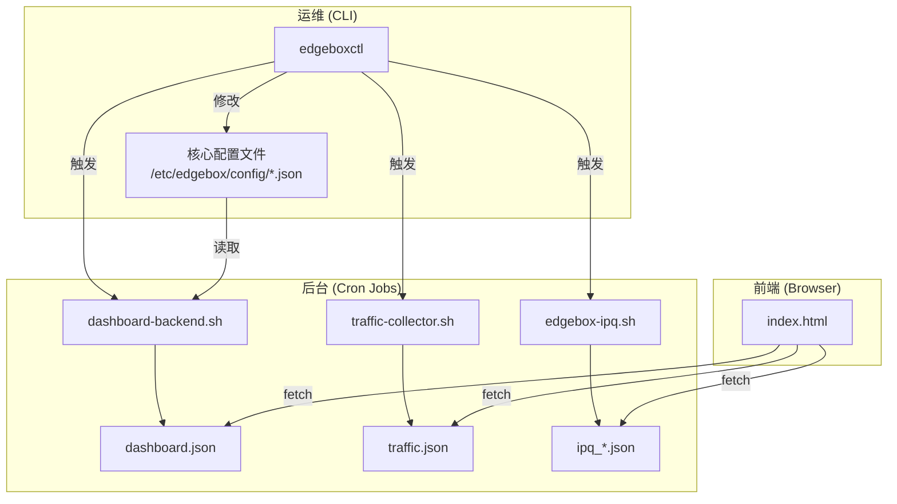

# **EdgeBox 项目总览 (v3.0 优化版)**

## **1. 架构哲学：模块化、原子化与内核契约**

EdgeBox 的核心是一个企业级的多协议节点部署与运维平台，它遵循三大设计哲学：

  * **模块化 (Modularity)**：整个安装脚本 (`install.sh`) 被拆分为7个逻辑清晰、职责明确的模块。每个模块负责一部分独立功能（如基础环境配置、凭据生成、服务部署等），便于独立开发、测试和维护。
  * **原子化 (Atomicity)**：`edgeboxctl` 工具中的所有命令都被设计为原子操作。这意味着每个命令要么完全成功，要么在失败时回滚或保持原状，确保了系统的可预测性和稳定性。
  * **内核契约 (Kernel Contract)**：模块间的协作依赖一套严格的“内核契约”，这套契约定义了文件路径、端口分配、服务依赖和配置格式的黄金标准。所有开发活动都必须遵守此契约，以保证系统的健壮性。

## **2. 核心技术架构**

EdgeBox 的精髓在于其创新的**Nginx-First**单端口复用架构与强大的出站分流系统。

### **2.1 网络架构：Nginx-First 单端口复用**

EdgeBox 并非简单地堆叠协议，而是通过一套精巧的流量分发机制，将所有 TCP 协议统一收敛至 `TCP/443` 端口，由 Nginx 作为唯一入口。

  * **工作流程**：

    1.  所有 TCP 流量（VLESS-Reality/gRPC/WS, Trojan）首先到达 Nginx。
    2.  Nginx 的 `stream` 模块通过 `ssl_preread` 功能，在不终止 TLS 的情况下，预先读取客户端请求的 **SNI (服务器名称指示)** 和 **ALPN (应用层协议协商)**。
    3.  基于预读信息，Nginx 将流量**直接转发 (`proxy_pass`)** 至 Xray 在内部回环端口 (`127.0.0.1`) 上监听的相应服务。
    4.  UDP 协议（Hysteria2, TUIC）则由 sing-box 直接监听在独立的公网 UDP 端口（`UDP/443`, `UDP/2053`），以保证最佳性能。

  * **优势**：

      * **深度伪装**：所有 TCP 流量均从单一 `443` 端口进出，从外部看与标准 HTTPS 流量无异。
      * **安全隔离**：核心应用（Xray）不直接暴露于公网，由 Nginx 作为安全代理，提升了安全性。
      * **高性能**：Nginx 的 `stream` 模块工作在四层，性能损耗极低。

| 流量类型 | 识别方式 | Nginx 转发目标 |
| :--- | :--- | :--- |
| **VLESS-Reality** | SNI 匹配 `*.microsoft.com` 等 | `127.0.0.1:11443` |
| **VLESS-gRPC** | ALPN 为 `h2` | `127.0.0.1:10085` |
| **VLESS-WebSocket** | ALPN 为 `http/1.1` | `127.0.0.1:10086` |
| **Trojan-TLS** | SNI 匹配 `trojan.*` | `127.0.0.1:10143` |
| **Hysteria2 / TUIC** | UDP 流量 | (不经过 Nginx) |

### **2.2 出站分流系统**

EdgeBox 提供了强大的出站路由控制，允许流量从**服务器原生 IP (VPS)** 或**上游代理 (Residential IP)** 出站。

  * **分流作用域：Xray-Only**：为了保证性能和兼容性，出站策略**仅对 Xray 处理的 TCP 协议生效**（VLESS 系列, Trojan）。Hysteria2 和 TUIC 始终通过 VPS 直接连接。
  * **三种模式**：
      * `vps` (默认)：所有 Xray 流量从服务器 IP 直出。
      * `resi`：所有 Xray 流量通过指定的上游代理转发。
      * `direct-resi` (智能分流)：白名单内的域名走 VPS 直连，其余走代理。
  * **流量统计**：通过 `nftables` 计数器精确区分 `vps` 和 `resi` 的流量，并在控制面板上可视化展示。

### **2.3 动态安全增强系统**

为了对抗日益复杂的网络审查，EdgeBox 内置了一套自动化、动态的安全增强机制。

  * **Reality 密钥轮换**：定时任务（默认60天）自动生成并替换 Reality 协议的密钥对，并通过 `rotate-sid` 实现 `shortId` 的无缝轮换，降低长期暴露风险。
  * **SNI 域名池管理**：定时任务（每周）会自动从内置的知名网站池（微软、苹果等）中智能测试并选择最优的 SNI 伪装域名，打破流量特征定势。
  * **流量特征随机化**：定时任务分层级（`light`, `medium`, `heavy`）自动微调 Hysteria2 和 TUIC 的底层参数（如伪装站点），对抗基于指纹的 DPI 检测。

## **3. 模块化解析 (`install.sh`)**

`install.sh` 脚本由7个高度解耦的模块构成，通过“内核契约”协同工作。

1.  **模块1：基础环境**

      * **职责**：初始化系统。
      * **任务**：自动提权、安装依赖 (`nginx`, `certbot`, `jq` 等)、创建目录、配置防火墙、优化内核参数 (BBR)。

2.  **模块2：凭据生成**

      * **职责**：生成所有安全凭据。
      * **任务**：检测云厂商、生成各协议 UUID/密码、生成 Reality 密钥对，并将所有信息写入 `server.json`。

3.  **模块3：服务配置**

      * **职责**：部署三大核心服务。
      * **任务**：安装 Xray 和 sing-box，生成 `nginx.conf`, `xray.json`, `sing-box.json`，并创建 `systemd` 服务。

4.  **模块4：后台脚本生成**

      * **职责**：创建为 Web 面板提供数据的后端脚本。
      * **任务**：生成 `dashboard-backend.sh`，负责定时聚合系统状态、配置详情等，输出为 `dashboard.json`。

5.  **模块5：运维工具集**

      * **职责**：构建完整的运维能力。
      * **任务**：创建流量采集 (`traffic-collector.sh`)、流量预警 (`traffic-alert.sh`)、IP 质量评分 (`edgebox-ipq.sh`) 等脚本，并生成核心管理工具 `edgeboxctl`。

6.  **模块6：主流程控制**

      * **职责**：编排安装流程，完成收尾工作。
      * **任务**：按顺序执行各模块、启动并验证服务、生成初始数据、显示最终安装信息。

7.  **模块7：前端控制面板**

      * **职责**：提供用户友好的 Web UI。
      * **任务**：生成纯静态的 HTML/CSS/JS 文件，通过 `fetch` API 异步加载后端 JSON 数据进行渲染。

## **4. 文件结构与数据流**

项目的稳定运行依赖于一套设计精良的文件结构和清晰的数据流。

### **4.1 最终文件结构**

```plaintext
/etc/edgebox/
├── cert/                   # 证书目录
│   ├── current.key         # 当前私钥 (软链接)
│   └── current.pem         # 当前证书 (软链接)
├── config/                 # 核心配置
│   ├── server.json         # 主配置文件 (凭据、服务器信息)
│   ├── xray.json           # Xray 配置
│   ├── sing-box.json       # sing-box 配置
│   └── shunt/              # 出站分流配置
├── scripts/                # 后台运维脚本
│   ├── dashboard-backend.sh
│   ├── traffic-collector.sh
│   └── ...
└── traffic/                # Web 根目录 (前端可读)
    ├── index.html          # 控制面板入口
    ├── dashboard.json      # 面板主数据
    ├── traffic.json        # 流量统计数据
    └── logs/
        ├── daily.csv
        └── monthly.csv
/usr/local/bin/
├── edgeboxctl              # 核心管理工具
└── edgebox-ipq.sh          # IP 质量评分脚本
/var/www/edgebox/status/    # IP 质量报告 (前端可读)
└── ipq_vps.json
/root/edgebox-backup/       # 自动备份目录
```

*(这是一个简化的结构，完整版请参考 `install.sh` 中的定义)*

### **4.2 数据流架构**



## **5. 项目亮点与维护建议**

  * **企业级稳定性**：模块化设计、幂等性操作（可重复安装/卸载）、完善的错误处理与日志记录，共同构成了项目的基石。
  * **智能自动化运维**：从证书自动续期、动态安全增强到流量预警和自动备份，最大限度减少了人工干预的需求。
  * **高度可扩展性**：清晰的模块划分和严格的“内核契约”为未来增加新协议、新功能（如集群管理）提供了坚实的基础。
  * **维护建议**：
      * **开发**：严格遵循“内核契约”，将修改限制在对应的模块内。
      * **扩展**：新功能应优先通过扩展 `edgeboxctl` 来实现。
      * **测试**：在干净环境中进行完整安装、幂等性及卸载测试。
